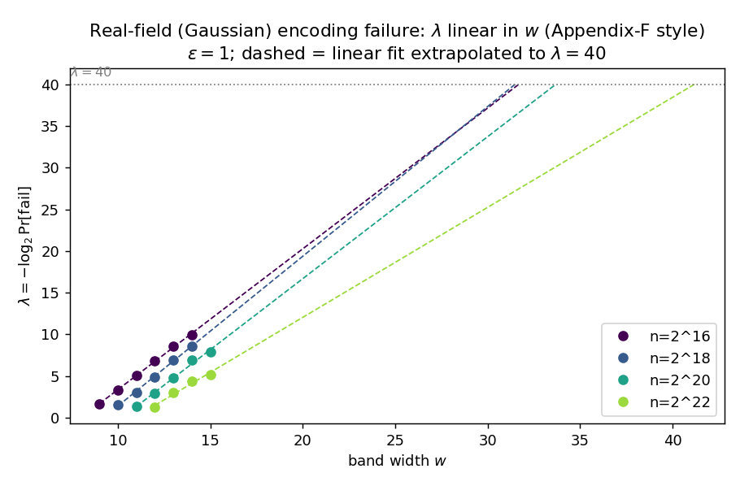

# Real-field RB-OKVS encoding: conditioning experiment

**Question.** For carrying real-valued payloads in CKKS we must solve the OKVS system
`M p = v` over `ℝ` instead of a prime field `Z_p`. Two things to measure:

1. If we run the **existing finite-field triangulation** (the `sgauss_elimination` of
   [`okvs.cpp`](../../rlwe-okvs/rlwe-okvs/okvs.cpp)) verbatim over the reals, how large does
   the solution `p` get relative to the values `v`?
2. With the **banded min-norm solve** (`p* = Mᵀ(MMᵀ)⁻¹v`, the `O(n w²)` method enabled by
   `MMᵀ` being banded), what does the solution look like, and how does it depend on the
   OKVS parameters?

**Band choice — Gauss is the default.** Coefficients are sampled `N(0,1)` ("full-entropy
real bands"), not binary `{0,1}`. The earlier rationale for binary — an "addition-only"
homomorphic decode — does not hold: the decode is `Σ_k PlainMult(ρ_k(ctxt), diag_k)`, and a
`PlainMult` costs the same whether the plaintext diagonal is `0/1` or real (the diagonal is
encoded into a dense plaintext polynomial and NTT-multiplied either way). Binary also gives
no encoding-time speedup off `GF(2)`. Meanwhile Gauss bands **condition strictly better**
(below), so they are the default; binary is kept only as a comparison baseline.

**Method.** [`okvs_real.cpp`](okvs_real.cpp) is a self-contained C++ port of `okvs.cpp`'s
`generate_band` + `sgauss_elimination` to `double` (no SEAL/Eigen). It adds a banded
Cholesky min-norm solver and estimates `σ_min(M)`, `σ_max(M)` by (inverse) power iteration.
Band start `∈ [0, m-w]`, width `w`, no wraparound (the RSB column permutation preserves
singular values, so it changes no norm here). Values `v ~ N(0,1)` (`‖v‖₂ ≈ √n`, per-entry
`~1`); 10 random instances per row. Reproduce:

```
g++ -O2 -std=c++17 -o okvs_real okvs_real.cpp && ./okvs_real results.csv && python3 plot.py
```

---

## Headline: the naive finite-field triangulation is unusable over `ℝ`

| config (Gauss, ε=1, w=24) | naive `‖p‖/‖v‖` | naive residual `max|Mp−v|` | **min-norm `‖p*‖/‖v‖`** | min-norm residual |
|---|---|---|---|---|
| n = 256  | `2.8 × 10⁶³` | `1.1 × 10⁴⁹` | **0.32** | `6.4 × 10⁻¹⁵` |
| n = 512  | `4.7 × 10¹²⁷` | `1.9 × 10¹¹³` | **0.32** | `1.1 × 10⁻¹⁴` |
| n = 1024 | `overflow (10²⁵⁵)` | `8.6 × 10²⁵⁴` | **0.32** | `1.1 × 10⁻¹⁴` |
| n = 2048 | `overflow` | `overflow` | **0.32** | `1.2 × 10⁻¹⁴` |
| n = 4096 | `overflow` | `overflow` | **0.32** | `1.3 × 10⁻¹⁴` |


- **Norm explodes** — `‖p‖/‖v‖` reaches `10⁶³ … 10¹²⁸ …` overflow, and the **decode residual
  itself blows up** (`10⁴⁹ … 10²⁵⁴ …`): the naive "solution" does not even satisfy `Mp=v`.
  It is numerical garbage, not a valid encoding.
- The exponent grows **linearly in `n`** (`10⁶³, 10¹²⁸, …`), i.e. the norm grows
  **exponentially in `n`** — the textbook growth factor of Gaussian elimination **without
  pivoting**. The finite-field algorithm takes the *first-nonzero* pivot (correct over
  `Z_p`, where there is no conditioning); over `ℝ` it repeatedly divides by near-cancelled
  tiny pivots, compounding over the `~n` sequential steps. Partial pivoting would fix the
  stability but destroy both the band structure and the `O(nw)` runtime.

**The min-norm solve, by contrast, is stable (`residual ≈ 10⁻¹⁴`), small (`‖p*‖ ≈ 0.32‖v‖`),
and `n`-independent.** So over `ℝ` we cannot reuse the finite-field encoder; we switch to
the banded normal-equation min-norm solve, whose `MMᵀ` is SPD so banded Cholesky needs no
pivoting and is unconditionally stable.

---

## How the min-norm solution behaves (Gauss bands)

### vs band width `w`  (n=1024, ε=1)

| w | full-rank ok | `σ_min(M)` | `‖p*‖/‖v‖` | garbage rms |
|---|---|---|---|---|
| 8  | 0.80 | 0.088 | 5.80 | 10.0 |
| 10 | 1.00 | 0.201 | 0.683 | 1.48 |
| 12 | 1.00 | 0.271 | 0.532 | 1.22 |
| 16 | 1.00 | 0.429 | 0.432 | 1.20 |
| 20 | 1.00 | 0.615 | 0.364 | 1.13 |
| 24 | 1.00 | 0.839 | 0.317 | 1.11 |
| 30 | 1.00 | 1.04 | 0.284 | 1.11 |
| 40 | 1.00 | 1.23 | 0.240 | 1.06 |


Larger `w` raises `σ_min` and shrinks `‖p*‖`. Below `w≈10` conditioning collapses
(`w=8`: `σ_min=0.09`, `‖p*‖=5.8‖v‖`).

### vs expansion `ε`  (n=1024, w=24) — **ε is the hard floor**

| ε | full-rank ok | `σ_min(M)` | `‖p*‖/‖v‖` | garbage rms |
|---|---|---|---|---|
| 0.05 | 0.30 | 0.00059 | 7.7 × 10⁵ | 3.7 × 10⁶ |
| 0.10 | 0.40 | 0.0041 | 541 | 2.1 × 10³ |
| 0.20 | 1.00 | 0.0415 | 1.08 | 5.03 |
| 0.30 | 1.00 | 0.145 | 0.883 | 3.75 |
| 0.50 | 1.00 | 0.350 | 0.432 | 1.73 |
| 1.00 | 1.00 | 0.765 | 0.323 | 1.08 |
| 2.00 | 1.00 | 1.18 | 0.267 | 0.77 |


This is the strongest effect in the study. As `ε → 0` (near-square), `σ_min → 0` and the
**min-norm solution itself explodes** (`‖p*‖ = 7.7×10⁵‖v‖` at `ε=0.05`) — banded Cholesky
is stable, but no amount of stability helps when the matrix is genuinely near-singular.
Redundancy moves `σ_min` over **three orders of magnitude** (`0.0006 → 1.18`). This is the
spectral-gap mechanism: `σ_min ≈ √m − √n = √n(√(1+ε)−1)`, so the redundancy `ε` is what
holds `σ_min` away from `0`. **`ε` is the primary conditioning knob, `w` secondary** — and
unlike the finite-field case (where bare full rank is reached at tiny `ε`), the real-field
OKVS needs a comfortable `ε` or it is ill-conditioned regardless of `w`.

### vs `n`  (ε=1, w=24) — **scale-invariant**


`σ_min ≈ 0.65–0.92`, `‖p*‖/‖v‖ ≈ 0.32`, `cond ≈ 10–15` are essentially **flat in `n`** —
conditioning is a property of `(ε, w)`, not `n`, so one parameter choice serves all set
sizes (matching the base paper's fixed parameters).

### Gauss vs binary bands  (n=1024, ε=1) — why Gauss is the default

| w | band | `σ_min(M)` | `‖p*‖/‖v‖` | full-rank ok |
|---|---|---|---|---|
| 16 | **gauss** | **0.501** | **0.404** | 1.00 |
| 16 | binary | 0.318 | 0.671 | 1.00 |
| 24 | **gauss** | **0.799** | **0.324** | 1.00 |
| 24 | binary | 0.473 | 0.546 | 1.00 |
| 32 | **gauss** | **1.04** | **0.272** | 1.00 |
| 32 | binary | 0.567 | 0.481 | 1.00 |


At equal `w`, Gauss bands give `σ_min` ~1.6–1.8× larger and `‖p*‖` ~1.6–1.8× smaller. Gauss
`w=16` already matches binary `w=24` in `σ_min` — i.e. Gauss reaches the same conditioning
with **~1/3 fewer diagonals**, hence a cheaper homomorphic decode and less communication, at
identical `PlainMult` cost. Combined with the cleaner `σ_min` theory (continuous coefficients
admit standard random-matrix tools), **Gauss is the fixed choice for the payload OKVS.**

---

## Takeaways for the construction

1. **Do not port the finite-field triangulation to `ℝ`.** It is exponentially unstable
   (norm and residual both explode). Use the **banded min-norm solve** `p*=Mᵀ(MMᵀ)⁻¹v`;
   `MMᵀ` is SPD and banded (bandwidth `O(w)` after sorting by start), so banded Cholesky is
   `O(nw²)`, pivot-free, and stable.
2. **The min-norm encoding is small** with `ε≥0.5, w≥16` (Gauss): `‖p*‖ ≈ 0.3–0.4‖v‖`, and
   the **garbage on non-keys sits at the payload scale** (`rms ≈ 1.1`). The CKKS masking
   residual `δ·garbage` is then `~δ`, negligible for any reasonable CKKS precision.
3. **`ε` is the dominant knob and a hard floor:** too little redundancy and even the min-norm
   solution explodes (`σ_min → 0`). Budget `ε` more generously than the finite-field OKVS.
4. **Gauss bands beat binary** (same cost, ~1.7× better conditioning, smaller `w`/garbage,
   cleaner theory) — fixed as the payload-band choice.

These numbers back the design-note claim that the real-field payload OKVS reduces to a
`σ_min` (conditioning) question, with the min-norm solution provably bounded by
`‖p*‖ ≤ ‖v‖/σ_min(M)` and efficiently computable.

## Caveats / next steps

- `σ_min, σ_max` are power-iteration estimates; `n ≤ 4096` for the detailed sweeps (the
  banded solver scales further, but conditioning is already flat in `n`).
- The remaining theory gap is the **`σ_min` tail bound** `Pr[σ_min(M) < t] ≤ 2⁻λ` for
  random width-`w` Gaussian band matrices; a proof sketch is in the design note
  ([`docs/encrypted-alignment-design.tex`](../../docs/encrypted-alignment-design.tex)).
  These experiments give the empirical `(ε, w) ↦ σ_min` surface that bound must match.
- Garbage is measured for fresh random query bands; in the protocol the non-key queries are
  OPRF'd items, same distribution, so the estimates transfer.

---

# Encoding failure vs band width (Appendix-F methodology)

[`failprob.cpp`](failprob.cpp) measures the **encoding-failure probability** of the
real-field OKVS as a function of band width `w`, following Appendix F of the paper. For
full-entropy (Gaussian / large-field) coefficients the encoding fails iff the band matrix is
rank-deficient, which generically happens iff the sparsity pattern admits **no perfect
row-to-column matching**; for equal-width bands this is an interval-matching feasibility test,
decided exactly by the leftmost-free greedy (the same rule the encoder's triangulation uses),
computed in `O(n α)` via a versioned union-find. We fit `λ = −log₂ Pr[fail] = a·w + g` and
extrapolate to `λ = 40` (`ε = 1`, n averaged over up to 40k random patterns).



**The relation is linear in `w` in the real field too** (R² ≈ 0.97–0.998), and — as the
paper's eq. (4) posits — the slope `a` is essentially **n-independent**. The robust
shared-slope fit gives `a ≈ 1.68` and:

| n | intercept g | **w at 2⁻⁴⁰** |
|---|---|---|
| 2¹⁶ | −13.4 | 32 |
| 2¹⁸ | −15.1 | 33 |
| 2²⁰ | −17.0 | **34** |
| 2²² | −19.2 | 35 |

Two takeaways:

- **n = 2²⁰ gives `w = 34`, matching the paper's full-field `Z_p`-band value (Table 6, ε=1.0)
  exactly.** Since Gaussian rank-failure = structural-matching-failure = large-field
  rank-failure, the real-field payload OKVS **inherits the paper's full-field band widths** —
  one can reuse the paper's `(ε, w)` table for the CKKS payload OKVS.
- The slope `a ≈ 1.68` is close to the paper's `Z_p` slope `1.73` (ε=1); the small gap is
  measurement noise (our trial counts are modest, especially the few high-`w`/low-fail points
  at n = 2²², whose per-n fit is the noisy outlier — the shared-slope fit corrects for it).

This also corroborates Theorem 1's prediction that `log Pr[ill-conditioned] ≈ −c·w` is linear
in `w` (binding term `min(εn, w) = w` here): the operative `w` for a `2⁻⁴⁰` target is
`Ω(λ)`, set empirically at ≈ 32–35 for these sizes.

---

# CKKS rotation-key decode (first implementation)

[`ckks_decode.cpp`](ckks_decode.cpp) (SEAL 4.1 + HEXL) realizes the encode → CKKS encrypt →
homomorphic band decode → decrypt round-trip **using homomorphic rotations (Galois keys), not
pre-rotated ciphertexts**, at scale `2⁴⁰`. First-cut scope: single block (`m = N` slots),
single diagonalized layer (`n` queries at distinct diagonal positions), Gaussian width-`w`
bands, min-norm encoding. The decode is

```
c* = Σ_{j=0}^{w-1}  rotate(c_p, j)  ⊙  diag_j        (w−1 Galois rotations + w plain-mults)
```

Representative run (`ring = 2¹⁴`, `N = 8192` slots, `n = 4000`, `ε ≈ 1.05`, `w = 24`,
scale `2⁴⁰`, coeff-mod `{60,40,40,60}`):

| quantity | value |
|---|---|
| `‖p*‖ / ‖v‖` (min-norm encode) | **0.306** (matches the Gauss conditioning study) |
| `‖p*‖_∞` | 0.97 |
| decode `max‖v′ − v‖` | `1.2 × 10⁻⁵` |
| decode `rms‖v′ − v‖` | `1.4 × 10⁻⁶` |
| **precision preserved** | **≈ 19 bits** |

The rotation-key decode is **correct** (`v′ ≈ v` at every matching slot) and preserves ~19
bits at scale `2⁴⁰` — consistent with CKKS's effective precision after a plaintext multiply
(the per-slot error `η` is ~`2⁻¹⁹`, larger than the naïve `‖p‖_∞·2⁻⁴⁰`; Corollary 1's
`|v′−v| ≤ √w·η` then gives the observed magnitude). For deeper payload precision, raise the
scale / modulus.

## Multi-block N-spacing (true RSB)

[`ckks_decode_multiblock.cpp`](ckks_decode_multiblock.cpp) extends the above to `m = b·N`
(`b` blocks, `p` in `b` ciphertexts), i.e. the real RSB with the `π_N` column permutation.
A band element of the contiguous-start-`s` query touches block `(s+j) mod b`, **wrap-level**
`r = (s%b + j) div b`, at output slot `τ = s div b`; crossing a block boundary shifts the
slot by `+1` — the super-diagonal — handled by the homomorphic rotation `rot_r`. The decode
of a layer is

```
out = Σ_{blk, r}  rotate(c_blk, r)  ⊙  diag_{blk,r}
```

with `rot_r(c_blk)` computed **once** by Galois-key rotation and reused across all layers.
Queries are sequenced into layers by `τ` (naive: one query per slot per layer). Run
(`ring = 2¹³`, `N = 4096`, `b = 8`, `m = 32768`, `n = 16384`, `ε = 1`, `w = 32`, scale `2⁴⁰`):

| quantity | value |
|---|---|
| `‖p*‖/‖v‖` | **0.268** |
| layers (naive sequencing) | 13 |
| ciphertexts / rotations | 8 base + **32 homomorphic rotations** (8 blocks × 4 wrap-levels) |
| decode `max‖v′−v‖` / `rms` | `5.1×10⁻⁶` / `1.5×10⁻⁷` |
| **precision preserved** | **≈ 22.7 bits** |

**All 16 384 queries verified `v′ = v`** — the multi-block N-spaced decode with rotation keys
is correct end-to-end. (Precision is ~23 bits here, slightly better than the single-block run
because `‖p‖` is smaller.)

**Deferred (next steps), as planned:**
- **sequencing optimization** — currently naive (one query/slot/layer → 13 layers at
  `n/N=4`); the paper's clustered Algorithm 3 reduces this to `O(n/N)` layers with `w+ζ`
  diagonals each;
- **garbage removal** (indicator OKVS + ssPMT share + the single ctxt×ctxt mask) — the
  decode delivers `⟨row(y),p⟩` for *every* slot, payload on matches and garbage on
  non-matches; masking off the garbage is the next implementation milestone.

Build:
```
SEAL=../../thirdparty/SEAL
g++ -O2 -std=c++17 -I$SEAL/native/src -I$SEAL/build/native/src \
  -I$SEAL/build/thirdparty/msgsl-src/include -I$SEAL/build/thirdparty/hexl-build/hexl/include \
  ckks_decode.cpp -o ckks_decode \
  $SEAL/build/lib/libseal-4.1.a $SEAL/build/thirdparty/hexl-build/hexl/lib/libhexl.a \
  $SEAL/build/lib/libz.a $SEAL/build/lib/libzstd.a \
  $SEAL/build/thirdparty/hexl-build/cmake/third-party/cpu-features/cpu-features-build/lib/libcpu_features.a -lpthread
```
