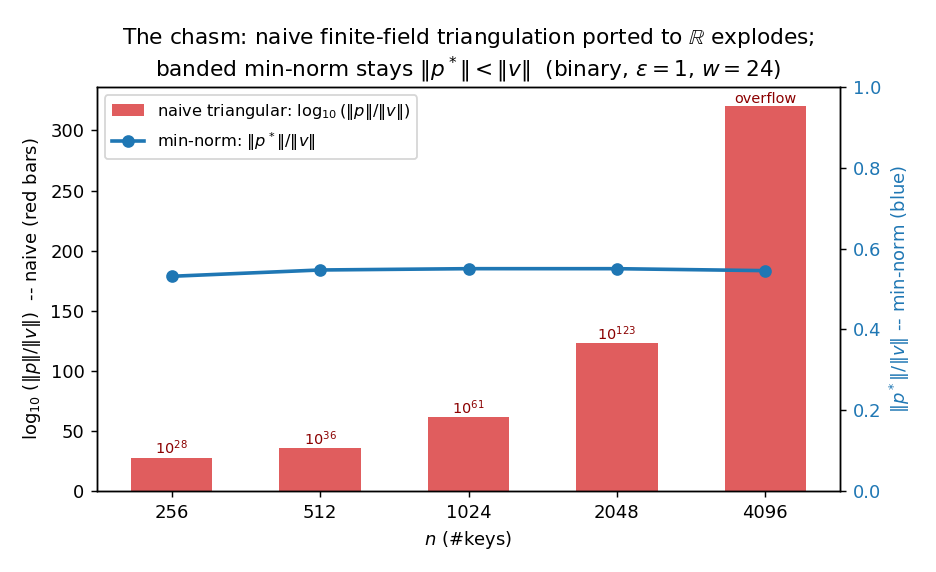
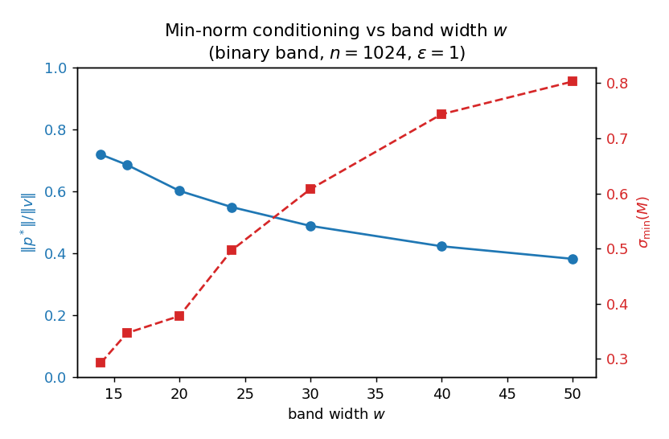
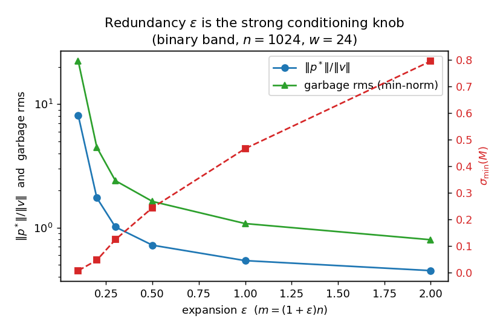
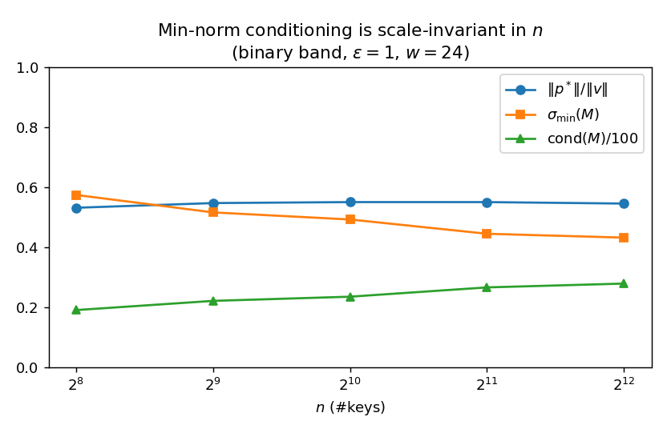
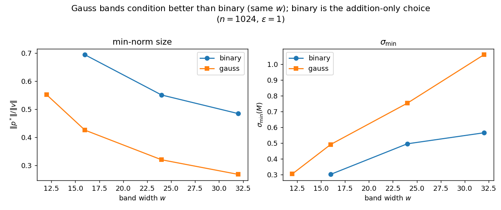

# Real-field RB-OKVS encoding: conditioning experiment

**Question.** For carrying real-valued payloads in CKKS we must solve the OKVS system
`M p = v` over `ℝ` instead of a prime field `Z_p`. Two things to measure:

1. If we run the **existing finite-field triangulation** (the `sgauss_elimination` of
   [`okvs.cpp`](../../rlwe-okvs/rlwe-okvs/okvs.cpp)) verbatim over the reals, how large does
   the solution `p` get relative to the values `v`?
2. With the **banded min-norm solve** (`p* = Mᵀ(MMᵀ)⁻¹v`, the `O(n w²)` method enabled by
   `MMᵀ` being banded), what does the solution look like?

**Method.** [`okvs_real.cpp`](okvs_real.cpp) is a self-contained C++ port of
`okvs.cpp`'s `generate_band` + `sgauss_elimination` to `double` (no SEAL/Eigen). It adds a
banded Cholesky min-norm solver and estimates `σ_min(M)`, `σ_max(M)` by (inverse) power
iteration. Bands follow the original conventions (start `∈ [0, m-w]`, width `w`, no
wraparound — the RSB column permutation preserves singular values so it changes no norm).
Values `v` are `N(0,1)` (so `‖v‖₂ ≈ √n`, per-entry `~1`); each row is averaged over 10
random instances. Binary band = `w` bits, leading bit `1`, rest `U{0,1}`; Gauss band =
`w` coeffs `~ N(0,1)` (real analogue of full-field `Z_p` coeffs). Reproduce with:

```
g++ -O2 -std=c++17 -o okvs_real okvs_real.cpp && ./okvs_real results.csv && python3 plot.py
```

---

## Headline: the naive finite-field triangulation is unusable over `ℝ`

| config (binary, ε=1, w=24) | naive `‖p‖/‖v‖` | naive decode residual `max|Mp−v|` | **min-norm `‖p*‖/‖v‖`** | min-norm residual |
|---|---|---|---|---|
| n = 256  | `3.8 × 10²⁷` | `1.2 × 10²⁸` | **0.53** | `5.9 × 10⁻¹⁵` |
| n = 1024 | `2.8 × 10⁶¹` | `6.0 × 10⁵⁹` | **0.55** | `1.2 × 10⁻¹⁴` |
| n = 2048 | `8.4 × 10¹²²` | `6.5 × 10¹¹⁴` | **0.55** | `1.6 × 10⁻¹⁴` |
| n = 4096 | `overflow (>10³⁰⁸)` | `5.8 × 10²²¹` | **0.55** | `1.6 × 10⁻¹⁴` |



Two facts:

- **Norm explodes** — `‖p‖/‖v‖` reaches `10²⁸ … 10¹²³ …` overflow. Worse, the **decode
  residual itself blows up** (`10²⁸ … 10²²¹`): the naive "solution" does not even satisfy
  `Mp=v`. It is numerical garbage, not a valid encoding.
- The exponent grows roughly **linearly in `n`** (`10²⁸,10³⁶,10⁶¹,10¹²³`), i.e. the norm
  grows **exponentially in `n`** — the textbook growth factor of Gaussian elimination
  **without pivoting**. The finite-field algorithm picks the *first-nonzero* pivot (correct
  over `Z_p`, where there is no conditioning); over `ℝ` that is catastrophically unstable,
  and partial pivoting would destroy both the band structure and the `O(nw)` runtime.

**The min-norm solve, by contrast, is both stable (`residual ≈ 10⁻¹⁴`) and small
(`‖p*‖ < ‖v‖`), and is `n`-independent.** So over `ℝ` we cannot reuse the finite-field
encoder; we switch to the banded normal-equation min-norm solve. The rest of the report
characterizes that solution.

---

## How the min-norm solution behaves

### vs band width `w`  (binary, n=1024, ε=1)

| w | naive ok (full-rank) | `σ_min(M)` | `‖p*‖/‖v‖` | garbage rms |
|---|---|---|---|---|
| 10 | 0.00 | — | — | — |
| 12 | 0.20 | 0.170 | 0.772 | 1.17 |
| 16 | 0.80 | 0.347 | 0.685 | 1.20 |
| 20 | 1.00 | 0.378 | 0.601 | 1.13 |
| 24 | 1.00 | 0.497 | 0.549 | 1.10 |
| 30 | 1.00 | 0.608 | 0.488 | 1.10 |
| 40 | 1.00 | 0.744 | 0.422 | 1.09 |
| 50 | 1.00 | 0.803 | 0.382 | 1.04 |



Larger `w` raises `σ_min` and shrinks `‖p*‖`. Below `w≈20` the matrix starts to fail
full-rank (small `ok`) — that is the *rank* threshold; conditioning needs a bit more margin
than bare rank.

### vs expansion `ε`  (binary, n=1024, w=24) — **ε is the strong knob**

| ε | naive ok | `σ_min(M)` | `‖p*‖/‖v‖` | garbage rms |
|---|---|---|---|---|
| 0.05 | 0.00 | — | — | — |
| 0.10 | 0.50 | 0.0081 | 8.10 | 22.3 |
| 0.20 | 0.80 | 0.047 | 1.74 | 4.47 |
| 0.30 | 1.00 | 0.124 | 1.01 | 2.40 |
| 0.50 | 1.00 | 0.244 | 0.721 | 1.63 |
| 1.00 | 1.00 | 0.466 | 0.541 | 1.08 |
| 2.00 | 1.00 | 0.794 | 0.449 | 0.80 |



Redundancy moves `σ_min` over **two orders of magnitude** (`0.008 → 0.79`) and the garbage
rms from `22 → 0.8`. This confirms the design-note claim that **`ε` (extra columns), not
`w`, is the natural lever for conditioning** — a near-square system (`ε≈0.1`) is badly
conditioned even when full-rank.

### vs `n`  (binary, ε=1, w=24) — **scale-invariant**



`σ_min ≈ 0.43–0.57`, `‖p*‖/‖v‖ ≈ 0.55`, `cond ≈ 19–28` are essentially **flat in `n`**.
Conditioning is a property of `(ε, w)`, not of `n` — exactly what a clean `σ_min` tail
bound would predict, and what makes the min-norm size analysis tractable.

### binary vs Gauss bands  (n=1024, ε=1)

| w | band | `σ_min(M)` | `‖p*‖/‖v‖` | naive ok |
|---|---|---|---|---|
| 24 | binary | 0.496 | 0.551 | 1.00 |
| 24 | gauss  | **0.753** | **0.320** | 1.00 |
| 32 | binary | 0.566 | 0.484 | 1.00 |
| 32 | gauss  | **1.061** | **0.268** | 1.00 |



At equal `w` (and full rank), **Gauss bands condition markedly better** than binary
(`σ_min` ~1.5× larger, `‖p*‖` ~1.7× smaller) — the real-field echo of the §4.3 "full-field
helps" effect. The trade-off is the one from the design discussion: **binary keeps the
homomorphic decode addition-only** (`0/1` coefficients), so the design preference is binary,
paying for it with a slightly larger `w` or `ε`. (The small-`w` binary `σ_min` figures are
survivorship-biased: only the few full-rank instances are averaged.)

---

## Takeaways for the construction

1. **Do not port the finite-field triangulation to `ℝ`.** It is exponentially unstable
   (norm and residual both explode). Use the **banded min-norm solve** `p*=Mᵀ(MMᵀ)⁻¹v`;
   `MMᵀ` is banded (bandwidth `O(w)` after sorting by start), so it costs `O(nw²)` —
   comparable to encoding — and yields a stable, bounded encoding.
2. **The min-norm encoding is comfortably small:** with `ε≥0.5, w≥20` (binary), `‖p*‖<‖v‖`
   and the **garbage on non-keys sits at the payload scale** (`rms ≈ 1.0–1.6` vs per-entry
   `v ≈ 1`). The CKKS masking residual `δ·garbage` is then `~δ`, negligible for any
   reasonable CKKS precision.
3. **`ε` is the primary conditioning knob, `w` secondary;** both are `n`-independent, so a
   single `(ε, w)` choice serves all set sizes (as in the base paper's fixed parameters).
4. **Binary vs Gauss is a real design fork:** binary for addition-only decode (preferred);
   Gauss if one is willing to pay real-coefficient `PlainMult` for ~1.5× better
   conditioning / smaller `w`.

These numbers back the design-note claim that the real-field payload OKVS reduces to a
`σ_min` (conditioning) question, with the min-norm solution provably bounded by
`‖p*‖ ≤ ‖v‖/σ_min(M)` and efficiently computable.

## Caveats / next steps

- `σ_min, σ_max` are power-iteration estimates; `n ≤ 4096` for the detailed sweeps (the
  banded solver scales further, but the conditioning is already flat in `n`).
- The remaining theory gap is the **`σ_min` tail bound** `Pr[σ_min(M) < t] ≤ 2⁻λ` for
  random width-`w` binary band matrices (Problem 1 of the design note); these experiments
  give the empirical `(ε, w) ↦ σ_min` surface that such a bound must match.
- Garbage here is measured for fresh random query bands; in the protocol the non-key
  queries are OPRF'd items, same distribution, so the estimates transfer.
